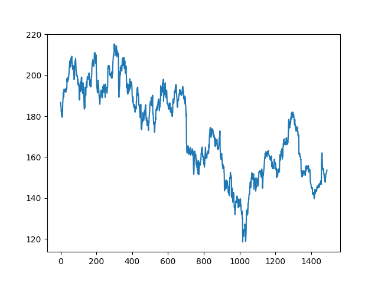
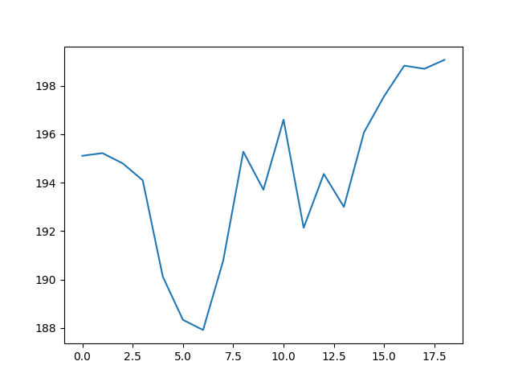
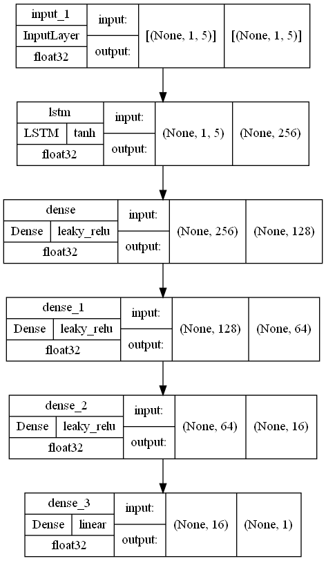
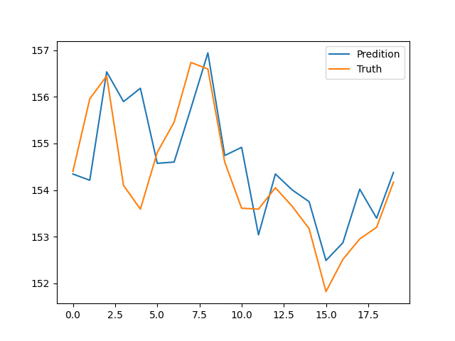
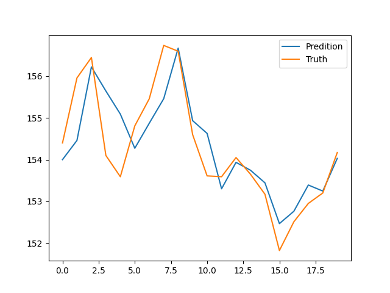
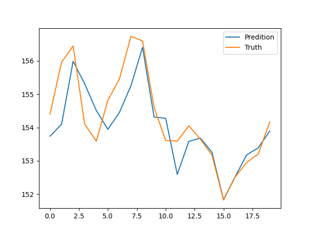
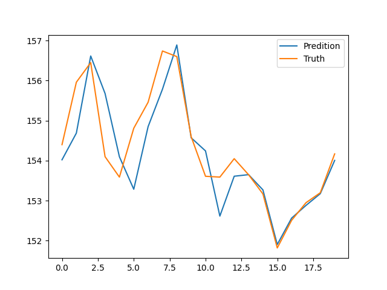
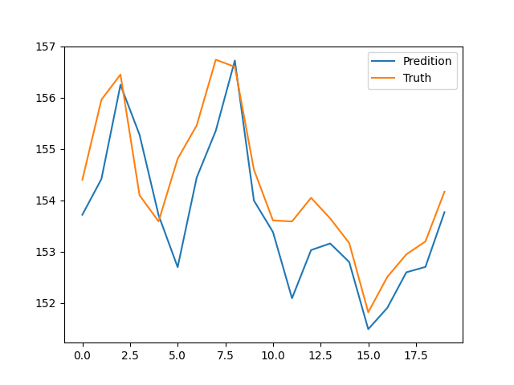
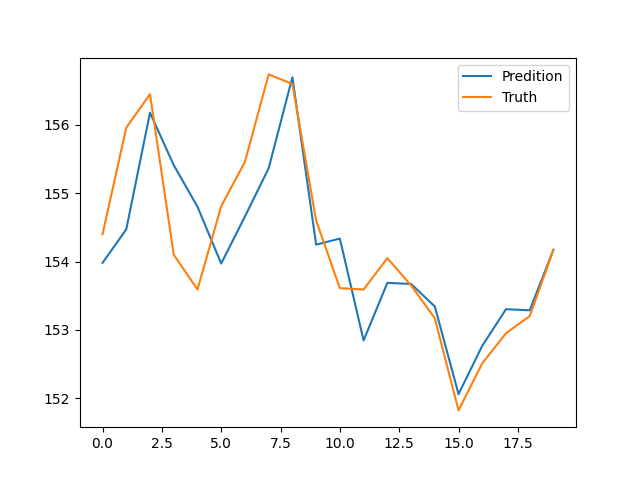

# DSAI-Auto_Trading

## 使用方式

跟原本規定的一樣
```
//安裝
pip install -r requirements.txt

//執行
python trader.py --training <training file> -- testing <testing file> --output <output file>
```

## 想法

### 小觀察

先把原始的資料畫出來看看。



看起來，一個大一點的週期可以超過 100 天。
但是因為我們的目標只要 20 天，如果包含了太以前的資料再預測，可能會跟上次一樣反而影響到預測結果。
所以目前猜測，之後的模型在預測的當下不用看到太以前的資料。



實際上把隨機某 20 天的資料畫出來，可以發現在短線內實在是沒有什麼肉眼可見的規律。

如果要單用之前的資料就一次預測未來的 20 筆資料，似乎有點強人所難。所以打算讓模型看一定長度的資料後，再預測下一天的開盤價就好。
感覺大概是這樣：
```
[t0, t1, ... , tn  ] => [tn+1]
[t1, t2, ... , tn+1] => [tn+2]
[t2, t3, ... , tn+2] => [tn+3]
```

### 整理資料

既然決定了輸入輸出的形式，就來將資料變成到時候可以用的樣子：

除了原本的資料，還另外算了(今天/昨天)的漲跌比例。

```python
def make_data(data, window):
    for data 中每一組 window+1 長度的連續資料 [tn, tn+1, ... , tn+window]:
        x.append(tn 到 tn+window-1)
        y.append(tn+window 的開盤價)
    return np.array(x), np.array(y)
```

另外，還有預測時拿資料的方式：

```python
def take_input(data, window):
    return np.array(data 從後面數來 window 筆資料)
```

### 訓練

選擇了 lstm 當模型。考慮到之後的資料和現在的不一樣，所以嘗試了各種配置，最後選擇了一個還算穩定的配置，mse 通常都在 1 左右：



接著嘗試使用了各種 window size 看看。

| Window Size | 結果 |
| :---: | :---: |
| 1     |    |
| 5     |    |
| 15    |   |
| 30    |   |
| 100   |  |
| 500   |  |

其實每個 window size 的表現都差不多...。

因為之後的 testing data 根本沒有那麼多資料可以用，所以乾脆選 window size = 1。

### 決策邏輯

在有了預測值之後，發現預測到的數值無論模型、window 或資料量的大小，都會有最多一天的延遲。~~我十分懷疑這個東西的準確性和可靠度。~~
但無論如何，還是需要一個 output 的邏輯。

因為我的可信資料不夠多，所以採取了一個保守(?)又單純的方法：

1. 相信預測值，如果預測會漲或跌就買或賣，同時記錄價格。
2. 之後，如果有預測會賺錢就賣掉或買回來，不然就不要操作。

其實感覺有點像猜猜樂，特別是預測不到轉折點很容易就賠錢了><。